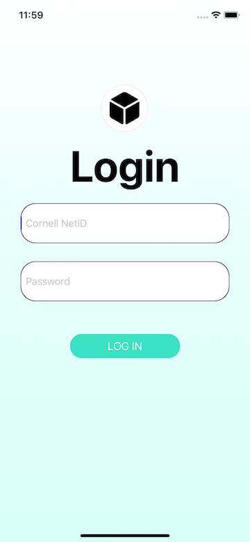
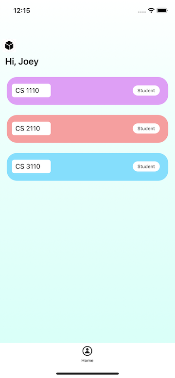
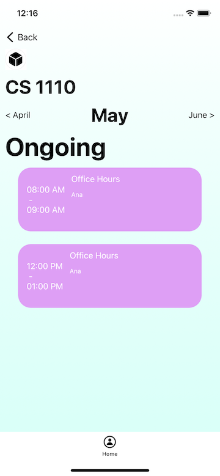
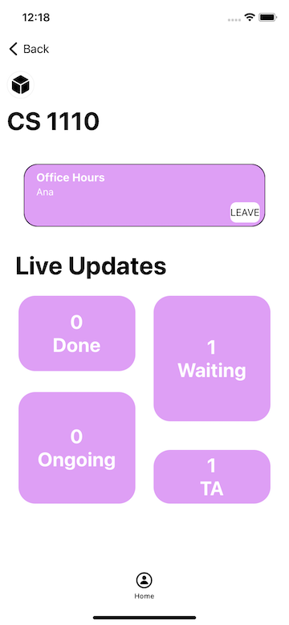

# NEXT Web and iOS App

## App Name: NEXT

The soon-to-be go-to office hours app on campus.

## Description

This app would allow for Cornell users to be able to have an amazing office hour experience.

The data for this app would eventually be filled with data from Student Center so users would not have to create an account or deal with adding courses.

## Features

The features currently implemented are the ability to view current courses (either as a student or instructor).

A user could also view the timeslots for a course and then can view information about the queue by clicking a timeslot.

They can also join/leave a queue.

Although we have yet to implement it on the frontend, the following features are supported by the backend:

- User logout
- Students being able to scroll through different days and months to view time slots
- Students being able to fill out a form to give some quick info to the TA
- Instructors seeing an instructor-specific Queue page view (showing a list of students)
- Instructors being able to add/delete timeslots

## Features

iOS:

1) Used SnapKit for layout
2) Used UICollectionView in HomeController and CourseController
3) Used UITabBarController for CustomTabBarViewController
4) Integrated with Backend API (all data currently displayed is from the backend)

Backend:

1) 6 POST Routes; GET Routes; DELETE Route
2) 6 Tables; 3 Relationships
3) API Specification with route descriptions: <https://docs.google.com/document/d/1w7hZGV2CeQnmG_XoH0eFa0ylxJ4hBtEGHCEiPj2U2kM/edit?usp=sharing>
4) Implemented User Authentication (all routes used by app depend on session token) [Example: only students for a course could view the time slots for a course]
  
## Screenshots

### Login Page

### Home Page

### Course Timeslots Page

### Timeslot Queue Page

